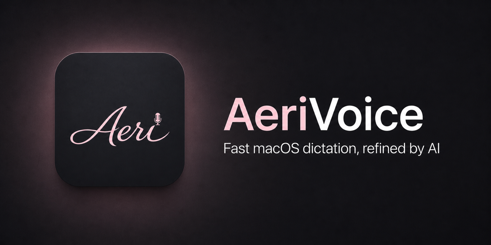

<p align="center">
  
</p>

# AeriVoice

AeriVoice is a fast, native macOS menu-bar dictation app. It streams speech to
your selected transcription provider, refines the transcript with an AI cleanup
provider, and inserts the result into the app you are using.

> [!WARNING]
> AeriVoice is beta software for power users. It requires your own paid or
> usage-limited provider accounts, and provider charges may apply.

## What it does

- Realtime transcription through Soniox or Meta Muse Voice Transcribe, with a
  compact notch-style live transcript. Soniox remains the default.
- Faithful or polished AI cleanup through OpenRouter, with optional experimental
  direct Groq cleanup.
- Gemini 3.5 Flash Lite with Minimal reasoning as the default for new installs.
- A global tap-or-hold shortcut, vocabulary hints, optional sound cues, and
  launch at login.
- Accessibility-aware insertion into native and Electron apps, with a safe
  copy-and-warn fallback when direct insertion cannot be verified.
- Local, content-free latency diagnostics with a 90-day retention window.

## Requirements

- An Apple Silicon Mac running macOS 26 or newer.
- A [Soniox API key](https://console.soniox.com/) or a
  [Meta Model API key](https://dev.meta.ai/docs/speech-to-text) for realtime
  transcription.
- An [OpenRouter API key](https://openrouter.ai/settings/keys) for the default
  cleanup provider.
- Microphone and Accessibility permission.

Meta transcription and direct Groq cleanup are optional. You can configure them
during onboarding or later in Settings.

## Install the beta

1. Download `AeriVoice-v0.1.0-beta.2-arm64.dmg` and its `.sha256` file from the
   [latest GitHub release](https://github.com/DanielOu1208/aerivoice/releases).
2. From the download directory, verify the artifact:

   ```sh
   shasum -a 256 -c AeriVoice-v0.1.0-beta.2-arm64.dmg.sha256
   ```

3. Open the DMG and drag AeriVoice to Applications.
4. Launch AeriVoice and complete the three onboarding steps.

AeriVoice does not include an automatic updater. Check GitHub Releases for new
versions.

## Build from source

You need Xcode 26.4.1 or newer with the macOS 26 SDK.

```sh
git clone https://github.com/DanielOu1208/aerivoice.git
cd aerivoice
open AeriVoice.xcodeproj
```

Choose your own development team in Xcode if signing is required, then run the
`AeriVoice` scheme. CI builds without code signing.

To run the complete test suite from Terminal:

```sh
xcodebuild \
  -project AeriVoice.xcodeproj \
  -scheme AeriVoice \
  -configuration Debug \
  -destination 'platform=macOS,arch=arm64' \
  test
```

## Privacy and security

AeriVoice has no account system or first-party server. Audio, transcripts, and
API keys still cross important trust boundaries:

- Microphone audio and vocabulary hints are sent to the selected transcription
  provider: Soniox or Meta. Meta sessions request zero data retention.
- The completed transcript is sent to OpenRouter or Groq when cleanup is used.
- API keys are stored in the macOS Keychain.
- Latency diagnostics stay on this Mac and exclude transcript text, vocabulary,
  credentials, clipboard contents, provider bodies, and raw errors.

Read [PRIVACY.md](PRIVACY.md) before using the app. Report vulnerabilities
privately as described in [SECURITY.md](SECURITY.md); never put credentials or
private transcript text in a public issue.

## Support and participation

[Open an issue](https://github.com/DanielOu1208/aerivoice/issues) for a bug or
focused feature request. The project is not currently accepting unsolicited
pull requests; see [CONTRIBUTING.md](CONTRIBUTING.md).

## License

Source code and repository artwork are available under the [MIT License](LICENSE).
