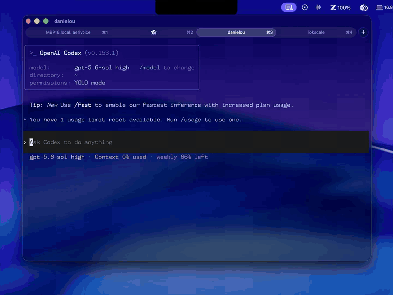

# AeriVoice

<p align="center">
  
</p>

<p align="center">
  <strong>Speak naturally. Write clearly. Anywhere on your Mac.</strong>
</p>

<p align="center">
  <a href="https://github.com/DanielOu1208/aerivoice/releases/latest">Download</a> ·
  <a href="#getting-started">Getting started</a> ·
  <a href="#providers-and-models">Providers</a> ·
  <a href="#privacy-and-security">Privacy</a>
</p>

<p align="center">
  <a href="https://github.com/DanielOu1208/aerivoice/releases/latest"></a>
  <a href="https://github.com/DanielOu1208/aerivoice/releases"></a>
  <a href="LICENSE"></a>
  <a href="#getting-started"></a>
  <a href="#getting-started"></a>
</p>

---

AeriVoice is a native macOS menu-bar dictation app that turns your speech into
clean text in the app you're using. See your words appear live, refine them with
AI, and keep writing without switching windows.

<p align="center">
  
</p>

## Why AeriVoice?

- **Fast transcription. Fast cleanup.** Pair Soniox's live transcription with
  Cerebras-powered AI cleanup for ready-to-use text with minimal waiting.
- **Choose your providers and models.** Pick from supported transcription and
  cleanup options to tune your setup around speed, quality, and cost.
- **Your words, your style.** Keep edits light with Faithful mode, or choose
  Polished mode for more refined writing.
- **Stay in your flow.** Tap or hold a global shortcut, follow the live transcript
  in a compact notch-style overlay, and send the finished text to your current app.
- **Make it personal.** Add vocabulary hints for names and specialist terms,
  enable sound cues, and launch AeriVoice at login.
- **At home on your Mac.** A native menu-bar experience, API keys stored in macOS
  Keychain, and no AeriVoice account required.

## Speed that keeps up

**~500 ms median from finishing dictation to sending cleaned text to your app
with Soniox + Cerebras.**

[Local benchmark details](docs/CLEANUP-PERFORMANCE.md#readme-performance-checkpoint-2026-09-07).
Timings vary by network, model, and provider load.

If Paste is unavailable, AeriVoice can copy the result for you.
[How Paste works](docs/TEXT-INSERTION.md#clipboard-and-result-reporting).

## Providers and models

Choose transcription and cleanup separately in Settings, using your own API keys.

| Stage | Provider | Supported models |
| --- | --- | --- |
| Live transcription |  **Soniox** — Default | Soniox Realtime |
| Live transcription |  **Meta** | Muse Voice Transcribe 1.0 |
| AI cleanup |  **OpenRouter** — Default | Gemini 3.5 Flash Lite, Gemini 3.7 Flash, GPT-5.6 Luna · Fast, GPT-OSS 120B · Cerebras |
| AI cleanup |  **Cerebras** — Experimental | Qwen 3.8 27B |
| AI cleanup |  **Groq** — Experimental | Qwen 3.8 27B |

**Default:** Soniox + Gemini 3.5 Flash Lite via OpenRouter, with Minimal reasoning.

**Speed setup:** Soniox + Qwen 3.8 27B via direct Cerebras, with reasoning set to None.

Switch providers, supported models, and reasoning effort in Settings.

## Getting started

AeriVoice is currently in **beta**. You'll need an **Apple Silicon Mac running
macOS 26 or newer**, plus your own provider accounts. Provider charges and usage
limits may apply.

1. **Install.** [Download the beta](https://github.com/DanielOu1208/aerivoice/releases/latest), open the DMG, and drag AeriVoice to Applications.
2. **Set up.** Add your API keys and grant Microphone and Accessibility permission during onboarding.
3. **Dictate.** Focus a text field and tap or hold your configured shortcut.

For the default setup: [Soniox API key](https://console.soniox.com/) +
[OpenRouter API key](https://openrouter.ai/settings/keys). Other providers are
available in Settings.

<details>
<summary>Verify your download</summary>

Download `AeriVoice-v0.1.0-beta.5-arm64.dmg` and its `.sha256` file from
[GitHub Releases](https://github.com/DanielOu1208/aerivoice/releases), then run
this in your download directory before opening the DMG:

```sh
shasum -a 256 -c AeriVoice-v0.1.0-beta.5-arm64.dmg.sha256
```

</details>

Updates are manual—check GitHub Releases for new versions.

## Privacy and security

- **Cloud processing:** audio and vocabulary go to your transcription provider;
  transcripts go to your cleanup provider. No AeriVoice account or first-party server.
- **Keychain storage:** API keys stay in macOS Keychain and authenticate requests
  to your chosen providers.
- **Local diagnostics:** timing logs stay on your Mac for 90 days, without
  transcript text, audio, or credentials.

[Privacy details](PRIVACY.md) · [Report a security issue privately](SECURITY.md)

## Build from source

<details>
<summary>Build and run tests with Xcode</summary>

You need Xcode 26.4.1 or newer with the macOS 26 SDK.

```sh
git clone https://github.com/DanielOu1208/aerivoice.git
cd aerivoice
open AeriVoice.xcodeproj
```

Choose your own development team in Xcode if signing is required, then run the
`AeriVoice` scheme. CI builds without code signing.

To run the complete test suite from Terminal:

```sh
xcodebuild \
  -project AeriVoice.xcodeproj \
  -scheme AeriVoice \
  -configuration Debug \
  -destination 'platform=macOS,arch=arm64' \
  test
```

</details>

## Support and participation

[Open an issue](https://github.com/DanielOu1208/aerivoice/issues) for a bug or
focused feature request. The project is not currently accepting unsolicited
pull requests; see [CONTRIBUTING.md](CONTRIBUTING.md).

## License

Source code and original AeriVoice artwork use the [MIT License](LICENSE).
Provider logos belong to their respective owners; see [artwork credits](docs/ARTWORK.md).
