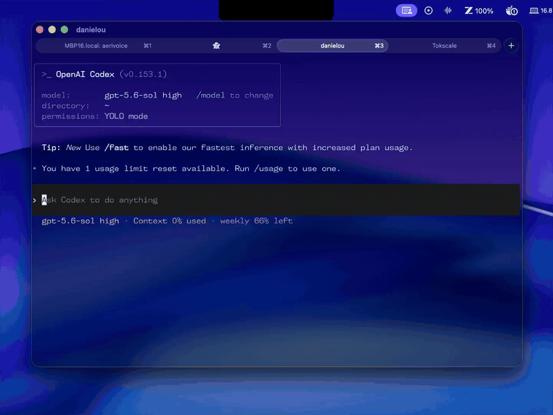

# AeriVoice

<p align="center">
  
</p>

<p align="center">
  <strong>Speak naturally. Write clearly. Anywhere on your Mac.</strong>
</p>

<p align="center">
  <a href="https://github.com/DanielOu1208/aerivoice/releases/latest">Download</a> ·
  <a href="#getting-started">Getting started</a> ·
  <a href="docs/PROVIDERS.md">Providers</a> ·
  <a href="#privacy">Privacy</a>
</p>

<p align="center">
  <a href="https://github.com/DanielOu1208/aerivoice/releases/latest"></a>
  <a href="https://github.com/DanielOu1208/aerivoice/releases"></a>
  <a href="LICENSE"></a>
  <a href="#getting-started"></a>
  <a href="#getting-started"></a>
</p>

---

AeriVoice is a native macOS menu-bar dictation app. Press a shortcut, watch your words appear live, and get clean text in the app you're already using.

<p align="center">
  
</p>

## Features

- **Live transcript, anywhere.** A notch-style overlay shows your words as you speak; the finished text lands in the focused app.
- **Fast.** About 500 ms median from finishing dictation to cleaned text with Soniox + Cerebras ([benchmark](docs/CLEANUP-PERFORMANCE.md#readme-performance-checkpoint-2026-09-07)).
- **Your choice of providers.** Soniox, Grok, Meta, or on-device Nemotron and Apple Speech for transcription; OpenRouter, Cerebras, or Groq for cleanup. [Providers and models](docs/PROVIDERS.md)
- **Cleanup styles.** Faithful, Polished, Compose, or your own instructions. [Cleanup styles](docs/CLEANUP-STYLES.md)
- **Offline mode.** On-device transcription with no API keys and no network requests. [Local dictation](docs/LOCAL-DICTATION.md)
- **Reliable capture.** Pick your microphone, keep recording when you switch inputs, and lose fewer words at the start and end. [Microphone](docs/MICROPHONE.md)
- **Built-in updates and Stats.** Signed in-app updates and private, on-device usage stats. [Usage stats](docs/USAGE-STATS.md)
- **No account.** API keys stay in the macOS Keychain.

## Getting started

Requires an **Apple Silicon Mac with macOS 26 or newer**.

1. **Install.** [Download the latest release](https://github.com/DanielOu1208/aerivoice/releases/latest), open the DMG, and drag AeriVoice to Applications.
2. **Set up.** Add a [Soniox](https://console.soniox.com/) and an [OpenRouter](https://openrouter.ai/settings/keys) API key for the default setup, or choose a local model and turn on Offline mode. Grant Microphone and Accessibility access.
3. **Dictate.** Focus a text field and use your shortcut: tap to toggle, or hold and release.

Cloud providers use your own accounts, and their charges apply. Updates install from **Settings → General → Check for Updates**; automatic checks can be turned off, and Offline mode pauses them. If Paste isn't available, AeriVoice copies the result instead ([how Paste works](docs/TEXT-INSERTION.md#clipboard-and-result-reporting)).

<details>
<summary>Verify your download</summary>

Download the DMG and its `.sha256` file from [GitHub Releases](https://github.com/DanielOu1208/aerivoice/releases), then run this in your download folder:

```sh
shasum -a 256 -c AeriVoice-v0.2.1-arm64.dmg.sha256
```

</details>

## Privacy

- **Cloud processing:** audio and dictionary hints go to your transcription provider; transcripts go to your cleanup provider. There is no AeriVoice server.
- **On-device option:** local models transcribe on your Mac; Offline mode skips cleanup and blocks AeriVoice network requests.
- **Keychain:** API keys are stored in the macOS Keychain.
- **Diagnostics:** optional, off by default, kept on your Mac, and never include audio, transcripts, or credentials.

[Privacy details](PRIVACY.md) · [Report a security issue](SECURITY.md)

## Build from source

<details>
<summary>Build and test with Xcode</summary>

Requires Xcode 26.4.1 or newer with the macOS 26 SDK.

```sh
git clone https://github.com/DanielOu1208/aerivoice.git
cd aerivoice
open AeriVoice.xcodeproj
```

Choose your development team if signing is required, then run the `AeriVoice` scheme. To run the tests:

```sh
xcodebuild -project AeriVoice.xcodeproj -scheme AeriVoice -configuration Debug \
  -destination 'platform=macOS,arch=arm64' test
```

</details>

## Support

[Open an issue](https://github.com/DanielOu1208/aerivoice/issues) for bugs or focused feature requests. Unsolicited pull requests aren't accepted; see [CONTRIBUTING.md](CONTRIBUTING.md).

## License

Source code and original artwork use the [MIT License](LICENSE). Provider logos belong to their owners; see [artwork credits](docs/ARTWORK.md) and [provider asset attribution](AeriVoice/ProviderIcons-LICENSE.txt).
